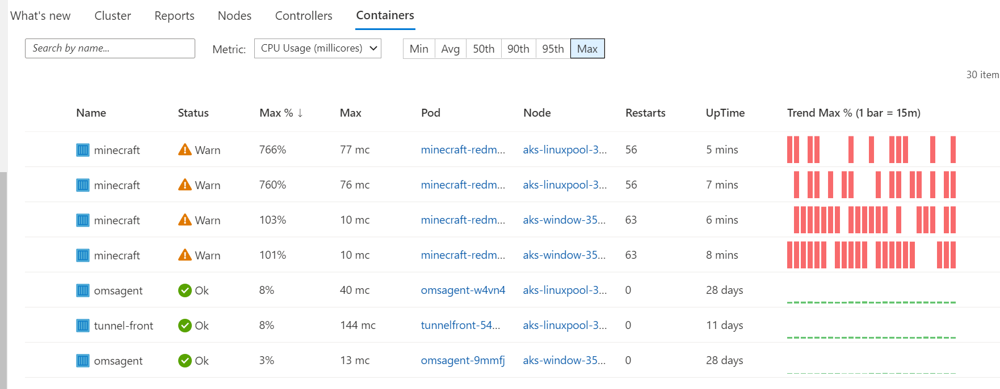

# Azure Container Monitor 

여기에서는 AKS 클러스터에 대한 모니터링 및 로깅 인사이트를 얻기 위해 컨테이너용 Azure Monitor를 활용하는 방법을 보여줍니다. 
만일 AKS Cluster를 만들때 모니터링 탭에서 **monitoring** 기능을 선택했으면 자동으로 해당 기능은 추가됩니다. 아래는 AKS 클러스터 생성후 add-on 기능을 통해 Enable 하는 과정을 보여줍니다.

## Instructions

1. Setup Azure Monitor for Containers

    * AKS 클러스터를 생성할 때에 **monitoring** 기능이 활성화 되어 있었을 경우에는 아무것도 할 필요가 없음. **Step 2** 로 바로 진행.
    * 만일 **monitoring** 기능이 설정되어 있지 않았을 경우에는 enable-addons az 명령어를 사용하여 활성화 시킬 수 있음. 만일 모니터링 기능이 활성화 되어 있는지 확실히 알지 못한다면 아래 omsagent daemonset 이 존재하는지 확인 할 수 있음. omsagent에 대한 결과가 없으면 **monitoring** 기능이 활성화 되어 있지 않은 것임.

        ```bash
        kubectl get ds omsagent --namespace=kube-system
        ```
    * 이미 만들어져 있는 AKS 클러스에서 add-on 명령을 통해 monitoring 기능 활성화.

        ```bash
        az aks enable-addons -a monitoring -g $RGNAME -n $CLUSTERNAME
        ```

2. Enable Master Node Logs in AKS

    * 가장 먼저 해야 할 일 중 하나는 마스터 노드 로그를 활성화하여 프로덕션 환경에서 애플리케이션을 실행할 때 문제 발생 시 원인을 파악하는 데  도움이 되도록 하는 것임. AKS 클러스터 단에 문제를 확인 할 수 있도록 Master Node Logs 를 Enable 함.
        * Azure Portal로 이동하여 AKS 클러스터를 선택.
        * AKS 클러스터 메뉴에서 **진단 설정/Diagnostic settings** 블레이드를 선택.
        
         
        
        * 마스터 로그를 수집하기 위해서 **Add diagnostic setting** 를 클릭.
        * **Diagnostic setting name** 에 이름을 쓰고고 Log 항목 중에 kube-apiserver, kube-audit, kube-audit-admin, kube-controller-manager, kube-scheduler, cluster-autoscaler를 선택하고, **Send to Log Analytics** 체크박스를 선택하고, 가지고 있는 **Log Analytics Workspace** 를 선택하여 마스터 노드 로그를 선택된 곳에 저장.
        * "저장" 클릭.

        

    * 참고: 마스터 노드 로그가 Log Analytics와 동기화를 시작하는 데 일정 시간이 소요됩니다.

3. Gaining Insights into Cluster Performance

    * 전체 Cluster Health와 관련하여 컨테이너용 Azure Monitor를 사용하여 모니터링 할 수 있는 항목.
        * Azure Portal로 이동하여 AKS 클러스터를 선택.
        * Monitoring 메뉴에서 Insights 메뉴를 클릭.
        
        

        * Cluster, Nodes, Controllers 그리고 Containers Tabs으로 구성되어 있음. Node, Contaoller 및 Container 탭으로 전환하면 해당 메뉴가 보여짐. kubernetes Object를 구성하기 위해 정의한 Label을 포함하여 선택한 항목의 속성이 표시됨. 
        * **Containers** 탭에는 배포된 마이크로서비스 애플리케이션과 연결된 Pod가 표시됨.
        
        

        * **Nodes** 탭에는 애플리케이션 Pod가 실행 중인 노드 확인.

4. Getting for Container Logs

    * 클러스터의 전반적인 성능을 앞에서 보고 event troubleshooting 이 필요한 상황에서는 컨테이너의 로그와 이벤트를 확인해 보아야 함. 
        * **Containers** 탭에서 컨테이너 중 하나를 선택합니다(예: **coredns**).
        * 오른쪽 Live Logs 창에서 **Live Logs** 를 클릭하면 다음과 같은 내용이 표시됨(Pod에서 kubectl 로그를 실행하는 것과 동일한 출력).
        
        

5. Running Custom Queries Against Logs

    * Containers Log Blade 창이 열려 있는 경우 해당 창을 사용해서 Log Analytics 로 이동 할 수 있음. 그렇지 않은 경우 다음을 수행하여 로그 창으로 이동.
        * AKS Cluster 선택
        * 왼쪽 메뉴 **Monitoring** Blade 에서, **Logs** 를 선택, Containers Log Blade 화면에서 View in Log Analytics 메뉴를 선택.

        

    * Logs window 에서 아래 예시를 Copy 하고 Query 하기 위해 **Run** 버튼을 클릭.
        * 쿼리를 진행하기 전에 왼쪽 메뉴 중 **Filter** 를 선택 함. ""Schema""를 살펴보면 다음을 확인 할 수 있음

        * List our Microservices Application Images

        ```text
        ContainerInventory
        | distinct Image
        | where Image contains "minecraft"
        | render table
        ```

        * List all of a container's lifecycle information.

        ```text
        ContainerInventory
        | project Computer, Name, Image, ImageTag, ContainerState, CreatedTime, StartedTime, FinishedTime
        | render table
        ```

        

        * Kubernetes Events

        ```text
        KubeEvents
        | where not(isempty(Namespace))
        | sort by TimeGenerated desc
        | render table
        ```

        * Image Inventory

        ```text
        ContainerImageInventory
        | summarize AggregatedValue = count() by Image, ImageTag, Running
        ```

6. Master Node Logs

    * 지금까지는 Worker Node에 대한 정보를 확인하였고 이제 Master Node에 대한 정보를 확인하려 함.
    * AKS Logs와 유사하게 아래 몇가지 Master Node 로그를 볼 수 있는 방법이 존재 함.
        * Look at Categories inside of Azure Diagnostics

        ```text
        AzureDiagnostics
        | distinct Category
        ```

        

        * Look at kube-apiserver Logs

        ```text
        AzureDiagnostics
        | where Category == "kube-apiserver"
        | project log_s
        ```

        * Look at a specific pod in the kube-apiserver Logs

        ```text
        AzureDiagnostics
        | where Category == "kube-apiserver"
        | where log_s contains "pods/service-tracker-ui"
        | project log_s
        ```

        

7. Alert     

    * **Alert** menu에 있는 13개의 항목이 Azure에서 중심적으로 보는 AKS의 모니터링 항목. 해당 Alert 사용 가이드.
        * 왼쪽 Monitoring Blade 에서 **Insights** 를 클릭 후 상단부의 Recommended Alerts 를 클릭.

        

        * Recommended Alert 에서는 Azure 에서 바라보는 AKS의 모니터링 항목이 포함되어 있음!. Alert 기능을 활성화 하여 문제시 해당 내용 확인 

        


## Troubleshooting / Debugging

* [Troubleshoot Azure Monitor for Containers](https://docs.microsoft.com/en-us/azure/monitoring/monitoring-container-insights-troubleshoot)

## Docs / References

* [Azure Monitor for Containers](https://docs.microsoft.com/en-us/azure/monitoring/monitoring-container-insights-overview?toc=%2fazure%2fmonitoring%2ftoc.json)
* [Understand AKS Cluster Performance](https://docs.microsoft.com/en-us/azure/monitoring/monitoring-container-insights-analyze?toc=%2fazure%2fmonitoring%2ftoc.json)
* [View kubelet Logs](https://docs.microsoft.com/en-us/azure/aks/kubelet-logs)


# Azure Nat Gateway Monitor 

여기에서는 Azure Nat Gateway Monitor 에 대한 SNAT 모니터링 과정을 보여줍니다.

## Instructions

1. Setup Azure Nat Gateway Monitor
    * Nat Gateway Monitor 메뉴 클릭
    * 왼쪽 Monitoring 블레이드에서 Metrics 클릭
    * Metric : SNAT Connection Count, Aggregation: Sum 선책
    * Apply splitting 클릭
    * Values : Connection State 선택
    
    


# Azure LoadBalancer Monitor 

여기에서는 Azure LoadBalancer Monitor 에 대한 SNAT 모니터링 과정을 보여줍니다.

## Instructions

1. Setup Azure LoadBalancer Monitor
    * LoadBalancer 메뉴 클릭
    * 왼쪽 Monitoring 블레이드에서 Metrics 클릭
    * Metric : Used SNAt Ports, Aggregation: Sum 선책
    * Apply splitting 클릭
    * Values : Backend IP Address 선택
    
    

# Azure VMSS Monitor 

여기에서는 Azure VMSS Monitor 에 대한 Disk IOPS 모니터링 과정을 보여줍니다.

## Instructions

1. Setup Azure VMSS Monitor
    * Virtual Machine Scale Set 메뉴 클릭
    * 왼쪽 Monitoring 블레이드에서 Metrics 클릭
    * Metric : OS Disk Queue Depth, Aggregation: Count 선책
    
    

